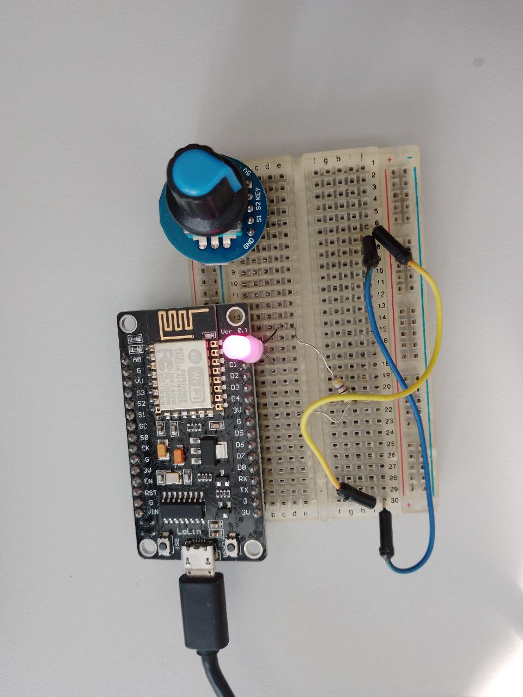

# git-nodemcu-led

Тестовый проект для визуализации MR с помощью светодиода.

## Настройки перед прошивкой

1. Необходимо установить  [vscode](https://code.visualstudio.com/download "download vscode")!
2. Заупустить vscode и установить расширение  (Extensions ctrl+shift+x) `PlatformIO`.
3. Далее, выполнить следующие действия:

```bash
sudo usermod -a -G dialout $USER
```

Если нет /dev/ttyUSB0: 
```bash
sudo apt remove brltty
```

Если Permission denied: '/dev/ttyUSB0'
```bash
sudo usermod -a -G dialout $USER
sudo reboot
```

## Схема подключения
D2 ---- LED +


